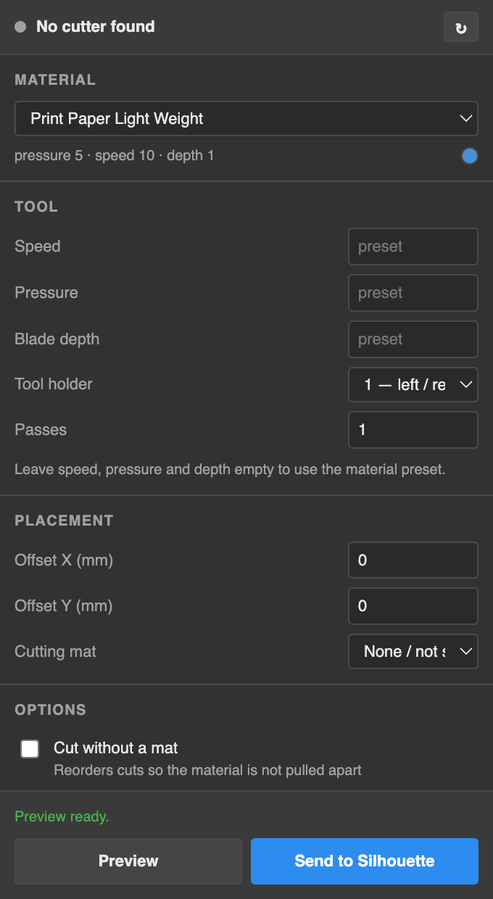
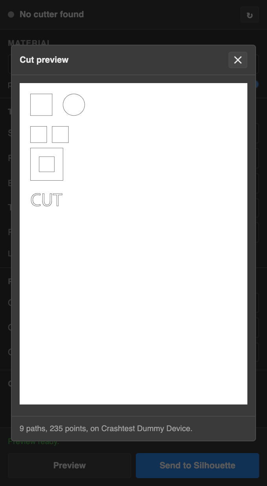

# Cameo for Illustrator

Send artwork from Adobe Illustrator straight to a Silhouette cutting machine —
no Silhouette Studio round-trip, no export step.

 

> **Status: pre-hardware.** The full pipeline works end to end in simulation and
> is covered by tests, but it has not yet been run against a physical cutter.
> Treat the first real cut as a calibration exercise — see
> [Before your first real cut](#before-your-first-real-cut).

## Key features

- **Cut straight from Illustrator.** No exporting, no Studio round-trip.
- **19 machines supported** — Cameo 1–5 (including Plus, Pro and Alpha),
  Cameo Pro MK-II, Portrait 1–4, Craft Robo and Silhouette SD. See
  [Supported devices](#supported-devices).
- **Honest preview.** *Preview* decodes the actual command stream the machine
  would receive and draws it back as geometry, so you see what the cutter will
  do, not an approximation of it. Preview never moves the machine.
- **Material presets from the driver's own table** — picking a material sets
  pressure, speed and blade depth on the machine, and the swatch shows the blade
  cap Silhouette recommends.
- **Your artwork is never modified.** Text is outlined automatically on a
  temporary duplicate.
- **Nothing is silently dropped.** Anything that can't be cut is listed in the
  panel rather than quietly skipped.
- **Bounding box only** traces just the outline of your design — a cheap sanity
  check on scrap before committing an expensive sheet.
- **Cut without a mat** reorders cuts so the material isn't pulled apart by a cut
  upstream of where the blade still has to travel.
- **Dry run** simulates a job end to end without moving the cutter.
- **No Homebrew, no `pip`, no `libusb` install.** Everything the panel needs is
  bundled.

## Installing

Grab the `.zxp` extension from the
[latest release](https://github.com/winslet/cameo-illustrator/releases), then
install it with a ZXP installer such as [ZXP Installer](https://zxpinstaller.com)
and restart Illustrator completely.

Full step-by-step instructions, including troubleshooting and uninstalling, are
in **[INSTALL.md](INSTALL.md)**.

**Requirements:** macOS 11 or newer, Adobe Illustrator 2020 (24.0) or newer, and
any Python 3.9+ on your Mac. Everything else is inside the `.zxp`.

## How to use

1. Connect your Silhouette by USB and switch it on. The panel header shows the
   model with a green dot when it finds one.
2. Select the paths you want to cut. With nothing selected, the whole artboard is
   used.
3. Pick a material. This sets pressure, speed and blade depth on the machine; the
   swatch shows the recommended blade cap.
4. Press **Preview** to see exactly what the machine would cut, decoded back from
   the command stream it would receive.
5. Press **Send to Silhouette**.

### What gets cut

Paths, compound paths and groups cut directly. Text is outlined automatically (on
a temporary duplicate — **your artwork is never modified**). Guides are skipped,
as is anything hidden or locked — including artwork that only inherits that state
from a hidden or locked **layer**, which Illustrator does not mark on the items
themselves.

Placed images, symbols, blends and envelopes cannot be cut and are reported in the
panel rather than silently dropped. Expand them first (**Object → Expand**).

Clipping masks are ignored: everything inside a clipped group is cut, not just the
visible part.

### Before your first real cut

The first cut on a real machine is the one thing simulation cannot stand in for.

1. Cut a **10 mm calibration square** on scrap and measure it. This is what catches
   unit and scaling errors.
2. Run **Bounding box only** on a real design with the blade removed or pressure at 1.
3. Then cut for real.

Placement is worth checking too. The driver offsets designs by each machine's
physical media margins, which differ per model — an original Cameo shifts 9 mm
across, the Cameo 5 family 6 mm the other way. The panel tells you when your model
does this, and the Offset X and Y fields correct it.

## Supported devices

All 19 machines below are driven by the vendored
[inkscape-silhouette][upstream] driver and covered by per-model wire-protocol
snapshot tests, so the exact byte stream each one receives is pinned in CI.

**No model has been confirmed on physical hardware yet.** That is the project's
single biggest gap, and the column below is what a
[device report](https://github.com/winslet/cameo-illustrator/issues/new?template=device-report.yml)
fills in — whether it worked or not.

Legend: ✅ confirmed on hardware · ⚠️ reported with issues · ⚪ not yet reported

| Machine | Cut width | Tested | Notes |
| --- | --- | --- | --- |
| Silhouette Cameo | 304 mm | ⚪ | Shifts designs 9 mm across, 1 mm down |
| Silhouette Cameo 2 | 304 mm | ⚪ | |
| Silhouette Cameo 3 | 304.8 mm | ⚪ | |
| Silhouette Cameo 4 | 304.8 mm | ⚪ | |
| Silhouette Cameo 4 Plus | 372 mm | ⚪ | |
| Silhouette Cameo 4 Pro | 600 mm | ⚪ | |
| Silhouette Cameo 5 | 330.2 mm | ⚪ | Shifts designs 6 mm the other way |
| Silhouette Cameo 5 Plus | 372 mm | ⚪ | |
| Silhouette Cameo 5 Alpha | 330.2 mm | ⚪ | Shifts 6 mm; higher max pressure (40) |
| Silhouette Cameo 5 Alpha Plus | 372 mm | ⚪ | Shifts 6 mm; higher max pressure (40) |
| Silhouette Cameo Pro MK-II | 609 mm | ⚪ | |
| Silhouette Portrait | 206 mm | ⚪ | |
| Silhouette Portrait 2 | 203 mm | ⚪ | |
| Silhouette Portrait 3 | 203 mm | ⚪ | |
| Silhouette Portrait 4 | 216 mm | ⚪ | |
| Craft Robo CC200-20 | 200 mm | ⚪ | |
| Craft Robo CC300-20 | not recorded | ⚪ | Legacy; no registration-mark support |
| Silhouette SD 1 | not recorded | ⚪ | Legacy; no registration-mark support |
| Silhouette SD 2 | not recorded | ⚪ | Legacy; no registration-mark support |

Cut widths and margins come from the driver's own device table; "not recorded"
means the driver does not carry a width for that model.

## Limitations

- **macOS only for now.** The transport layer is structured for Windows, but
  Windows needs care: the usual approach there replaces the driver with Zadig,
  which breaks Silhouette Studio until reverted. The better path is to talk
  through `usbprint.sys` directly, avoiding the swap — designed for, not built.
- **No hardware confirmation yet.** Everything is verified in simulation against
  pinned per-model byte streams; no model has been run against a physical cutter.
- **No Print & Cut.** Registration-mark sensing is supported by the underlying
  driver but not yet wired up in the panel.
- **No Bluetooth.** The driver supports it on Linux and Windows; macOS lacks the
  Python RFCOMM socket support it relies on.
- **Cancelling mid-cut** stops sending and sends the head home, but cannot undo
  what has already been cut.

## Contributing

Contributions are very welcome — see **[CONTRIBUTING.md](CONTRIBUTING.md)**, and
**[docs/development.md](docs/development.md)** for the architecture and the
developer workflow.

The single most useful thing you can contribute is a
[device report](https://github.com/winslet/cameo-illustrator/issues/new?template=device-report.yml),
whether it worked or not. This supports 19 machines that no one person owns, so
a confirmed "Portrait 3 cuts correctly" genuinely moves the project forward — and
a confirmed failure moves it further still.

## Licence

**GPL-2.0.** This project vendors GPL-2.0 code from
[fablabnbg/inkscape-silhouette][upstream], so the combined work is GPL-2.0. See
[`LICENSE`](LICENSE).

Enormous credit to the inkscape-silhouette maintainers — the hard part of this
problem is theirs, solved years ago.

[upstream]: https://github.com/fablabnbg/inkscape-silhouette
